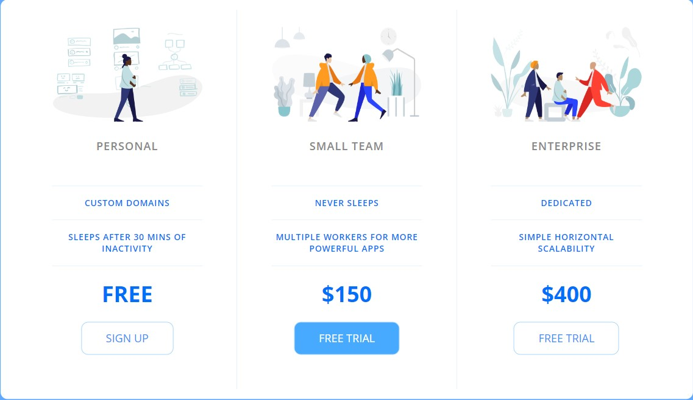

<h1 align="center">
  Pricing Table
 </h1>
  

  
  
  
   
  <a href="#-tech">Techs</a>&nbsp;&nbsp;&nbsp;|&nbsp;&nbsp;&nbsp;
  <a href="#-project">Project</a>&nbsp;&nbsp;&nbsp;|&nbsp;&nbsp;&nbsp;
  <a href="#-considerations"> Considerations </a>&nbsp;&nbsp;&nbsp;|&nbsp;&nbsp;&nbsp;
  

 

## 🚀 Tech
This project was developed with the following techs:

- Pure HTML and CSS

## 💻 Project
Is a Princing Table is a Responsive table using pure CSS and HTML 

 
 ## ♥ Considerations 
 Is a project front-end to develop Full-Stack portfolio
